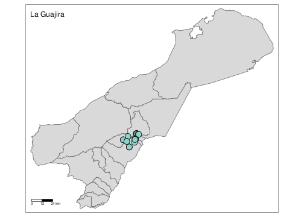
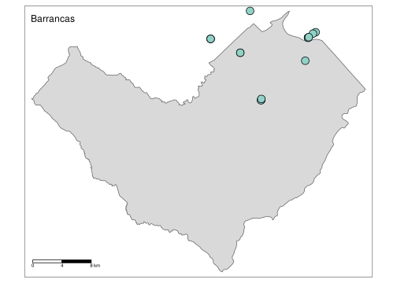

<!-- README.md is generated from README.Rmd. Please edit that file -->

# RSiBCOL

The goal of `RSiBCOL` is to create queries and get data from SiB
databases, This packages helps you to pull data from GIBF API like
*location*, *coordinates*, *sex*, *dates* and relevant information
related with taxonomy for any specie record in Colombia using R syntax.
Furthermore, `RSiBCOL` can create basic maps to represent records on a
geographic context and those maps can be customized easily using `tmap`
if you need specific changes.

## Installation

You can install the development version of `RSiBCOL` after installing
`colmaps` from [GitHub](https://github.com/) with:

``` r
install.packages("devtools")

if (!require("colmaps")) devtools::install_github("nebulae-co/colmaps")
devtools::install_github("diego-sierra-r/RSiB")
```

## Example

Imagine you need to get all *Caiman cocodrilus* records for a specific
year in Colombia. With `RSiBCOL` the first thing you have to do is go to
[GBIF Backbone Taxonomy](https://www.gbif.org/species/search) and find
the GBIF taxon ID. In this case is 8953936.

Then, it’s possible to use get_specie_records() function to find all
records for *Caiman cocodrilus* registered in 2020.

``` r
library("RSiBCOL")
```

``` r
get_specie_records(year = 2020, 
                   all.records = TRUE,
                   specieKey = 8953936)
```

If you want just some records you can use limit and offset arguments.

``` r
get_specie_records(limit = 5,
                   offset = 1,
                   year = 2020, 
                   all.records = FALSE,
                   specieKey = 8953936)
# when all.records = TRUE its overrides limit and offset arguments
```

This function returns a data.frame with more than 100 columns that you
can use for your own purposes, but if you just need you some basic
taxonomic information, coordinates and dates relevant_vars() keep just
10 columns.

``` r
colnames(relevant_vars(caiman_crocodilus))
#>  [1] "speciesKey"       "scientificName"   "family"           "dateIdentified"  
#>  [5] "decimalLongitude" "decimalLatitude"  "stateProvince"    "year"            
#>  [9] "month"            "day"
```

Other handy functions to clean data generated by get_specie_records()
are slicer() and filter_if_match().

``` r
slicer(caiman_crocodilus,1,10)

filter_if_match(caiman_crocodilus,
                column = "scientificName",
                terms = "fuscus")
```

Finally, `RSiBCOL` can generate some basic plots to represent records
over a map. This objects can be customized and enhanced using `tmap`
packaged according to specific needs.

``` r
# whole map
map_colombia(caiman_crocodilus,column = "scientificName")
```


``` r
# Department map
map_depto(df = caiman_crocodilus,
          depto = "La Guajira",
          legend.show = F,
          column = "species")
```



``` r
# Municipality map

map_mun(caiman_crocodilus,
        mun = "Barrancas",
        column = "species",
        legend.show = FALSE)
```


